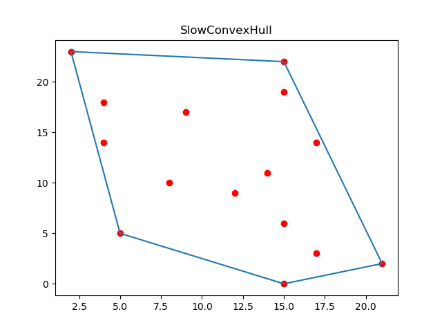

## Convex Hull Problem

Running instructions:

<code> python3 convexHull.py \<number\> </code>

To run the brute force algorithm: replace \<number\> with 1

To run Graham's scan: replace \<number\> with 2

The program will ask whether you want the input points to be generated randomly (y) or not (n) after running the above expression.

If yes, it will follow up by asking for the number of points to be generated.

If no, the program will ask for manual input of points. Enter the points in the format <code>x1 y1 x2 y2 ... xn yn</code> i.e. each coordinate separated by a space.

Example input of points: <code>8 6 2 9 8 7 5 3 4 6 5 1 0 9 6 9 4 7 5 6 5 2 9 8 1 3 8 0 1 2</code>

A png file with the entered points marked in red and the computed polygon drawn in blue will be generated, and the edges of the polygon will be printed as output.

Example 1                  |  Example 2
:-------------------------:|:-------------------------:
  |  

The brute force algorithm will only work correctly for very small numbers of input vertices, whereas Graham's Scan can easily compute the convex hull for large input sizes as well.