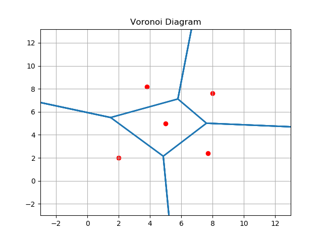
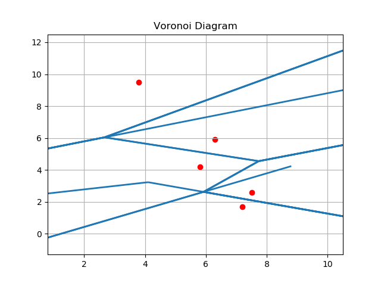

## Voronoi Diagram

Running instructions:

<code>python3 voronoiDiagram.py</code>

The program will ask whether you want the input points to be generated randomly (y) or not (n) after running the above expression.

If yes, it will follow up by asking for the number of points to be generated. (The current implementation does not work well for number of points exceeding 10.)

If no, the program will ask for manual input of points. Enter the points in the format <code>x1 y1 x2 y2 ... xn yn</code> i.e. each coordinate separated by a space.

Example input of points: <code>2.0 2.0 3.8 8.2 5.0 5.0 7.7 2.4 8.0 7.6</code>

A png file with the entered points marked in red and the computed voronoi diagram drawn in blue will be generated.

Example 1                  |  Example 2 (incomplete)
:-------------------------:|:-------------------------:
  |  

As can be seen from the above example 2, the parts of the segments plotted are not always correct yet - this is to be rectified going ahead.